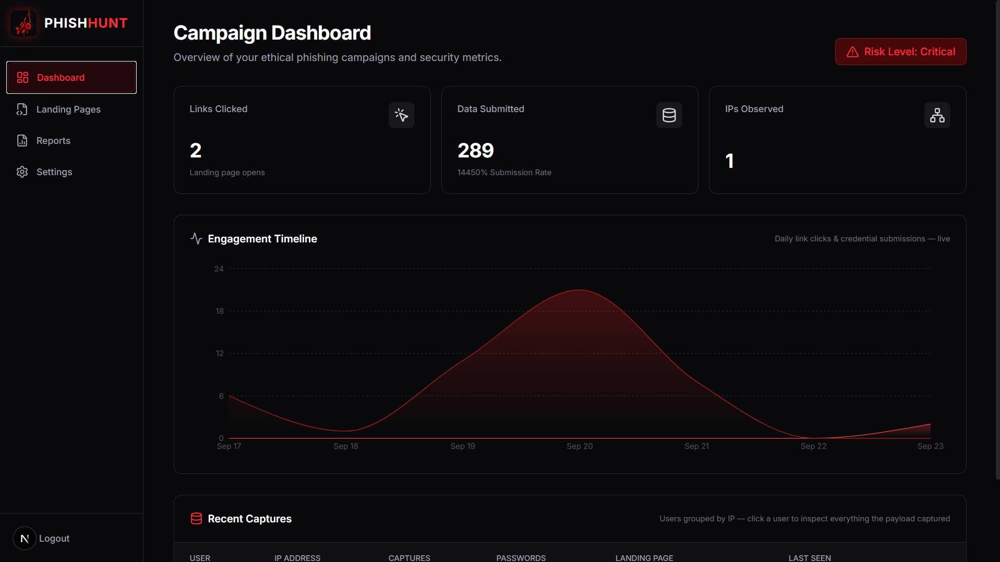
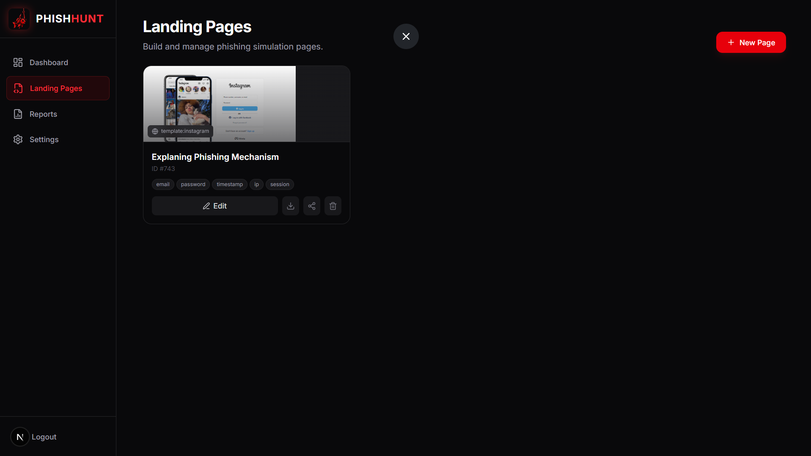
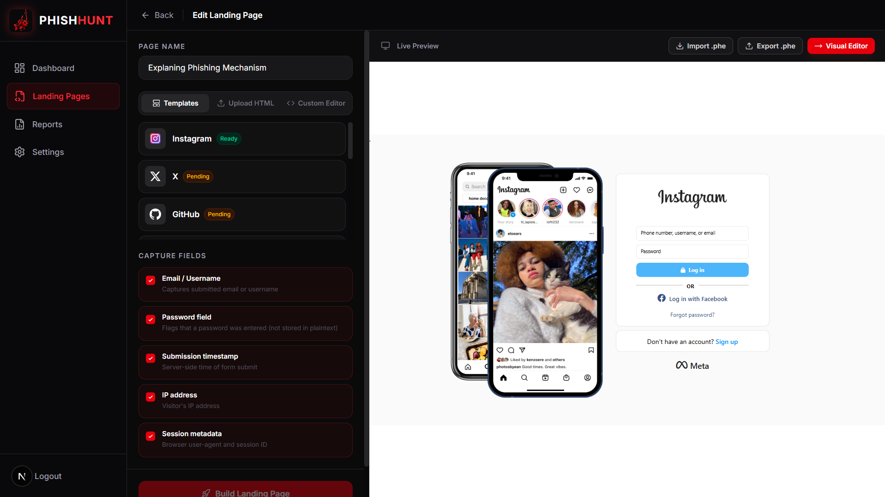
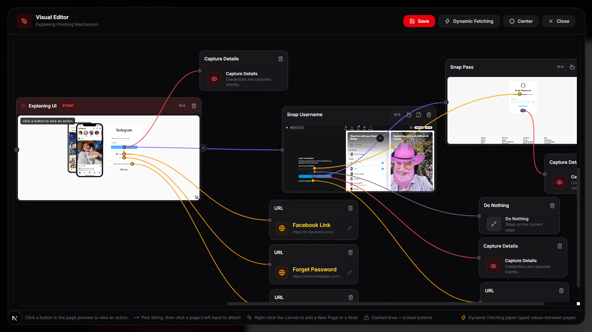
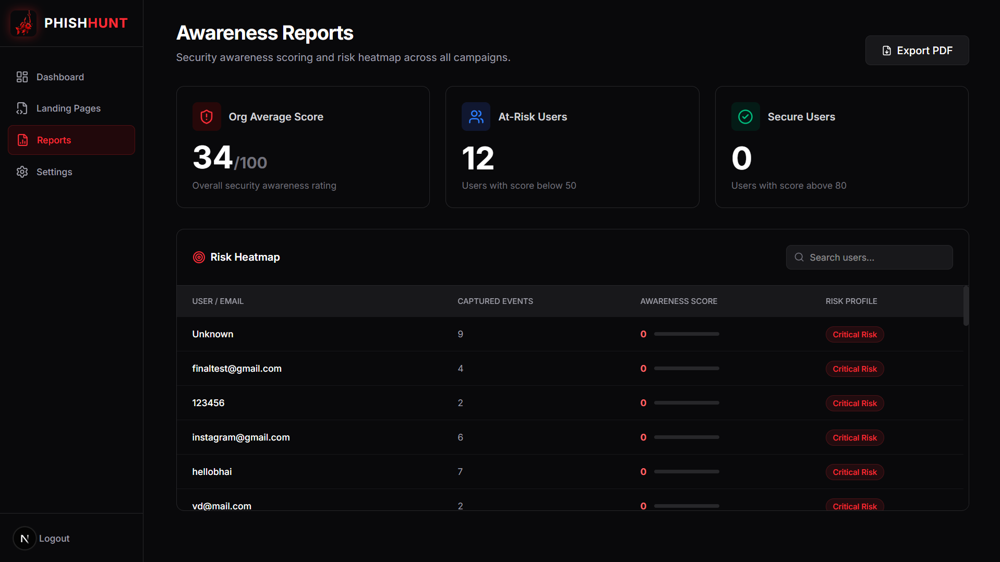

<p align="center">
  
</p>

<h1 align="center">
  
</h1>

<p align="center">
  <b>The Most Advanced Phishing Simulation & Security Awareness Tool</b><br>
  Ethical Security Testing Platform
</p>

---

> ⚠️ **For Education Purposes Only.** Phish Hunt is built to test and train people
> against phishing, never to attack real victims without written permission.

---

## 1. What is Phish Hunt? (Working Mechanism explained in simple words)

Phish Hunt is a **phishing simulation tool**. Companies (or security testers) use tools
like this to send fake " phishing " pages to their own employees. When an employee
types their username/password into the fake page, the tool captures that moment,
shows who fell for it, and then the company trains those people to be more careful.

Phish Hunt is proudly inspired by **GoPhish** (thank you, GoPhish — open-source
phishing simulation made this tool possible) and pushes the idea further with a
**full visual editor, real website cloning, and multi-page phishing flows**.

**How it works, step by step:**

1. **You create a Landing Page** — a phishing page that looks exactly like a real
   login page (Instagram, etc.).
2. **Phish Hunt clones the real website's HTML**, injects a small invisible
   "capture" script into it, and stores it in the database.
3. **You wire the page's buttons in the Visual Editor** — for example:
   *"when the user clicks Log in → capture what they typed → send them to the
   next page."* You can chain **multiple pages together** (a username page, then a
   password page, then a "wrong password" page), which makes it extremely
   realistic. **This multipage phishing is the core focus of Phish Hunt.**
4. **You share the link** (example: `http://localhost:3000/build/1`) with the
   people you are testing.
5. **Everything is recorded, live:** every page visit counts as a *Link Click*,
   every typed email/username is captured along with the password entry moment,
   IP address, browser, and timestamp.
6. **The Dashboard shows it all in real time** — recent captures grouped per user,
   a live engagement timeline, and risk levels. **Reports** then turn the data
   into awareness scores so you know exactly who needs training.

In short: **clone a real page → wire buttons visually → share the link → watch
captures arrive live → measure awareness.**

---

## 2. Landing Pages & the Starter Template (ID #0)

Landing Pages are the heart of Phish Hunt. Every phishing simulation starts by
creating one from **Landing Pages → Edit Landing Page**, where you can:

- **Templates** — pick a ready-made template (Instagram, X, GitHub, …).
- **Upload HTML** — upload your own page file.
- **Custom Editor** — write/paste your own HTML.
- Choose **Capture Fields** (Email, Password flag, Timestamp, IP, Session).
- Open the **Live Preview**, then jump into the **Visual Editor**.

### Template ID #0 — the built-in starter flow

A fresh install automatically ships one ready-made phishing project as
**Template ID #0 / Page ID #743 — "Explaning Phishing Mechanism"**
(from the file `backend/seed/743-explaining-phishing-mechanism.phe`).

It is a complete worked example of a **multi-page phishing flow**: the real
Instagram login page starts the chain, the typed credentials are captured
silently, the user is passed to the next pages, and **Dynamic Fetching**
pipelines the typed username from page 1 into page 2 automatically so the
victim never notices. Open it, study it, run it (`/build/743`), duplicate it,
or export it as a `.phe` file — it is the fastest way to understand how
everything works. It is only seeded on a *fresh* database, so if you delete it,
it never comes back.

**Templates available right now: for the moment only the Instagram template is
built in (the rest are marked "Pending"). More templates — X, GitHub, Facebook,
Google, Microsoft, Netflix, PayPal, TikTok, Discord — will be available in
future updates.**

---

## 3. What makes Phish Hunt special

### 🎨 Visual Editor (Drag → Click → Done)
Instead of writing code, you connect nodes on a big canvas:

- Drop **New Page** nodes and unlock their buttons.
- Click a button in the live page preview, then click an action node
  (**Capture / New Page / URL / Do Nothing**) to wire it.
- **Right-click the canvas** to add New Pages or Notes.
- Dashed lines = locked buttons. Everything is saved with one click of **Save**.

### 🔀 Dynamic Fetching (DF)
A unique feature: a typed value flows from one page to the next automatically.
Type your email on page 1 — page 2 opens with that same email already filled in.
You build it by "picking a string" on the source page and attaching it to the
input/text element on the target page. The runtime pipes the value through
`sessionStorage` while the victim browses the flow.

### 📦 Community Template Sharing — the `.phe` file
The whole Visual Editor state of a page (every panel, note, URL, capture wiring,
Dynamic Fetching mark and every New Page's HTML) compiles into **one shareable
`.phe` file**. Send it to a friend, they click **Import .phe** and get the exact
same flow. Perfect for sharing community templates. Importing also writes the
plain `.html` files into a folder you choose.

---

## 4. Requirements & Versions

Install these once:

| Requirement   | Version  | Download |
|---------------|----------|----------|
| Python        | 3.11+    | https://www.python.org/downloads/ |
| Node.js       | 20+      | https://nodejs.org/ (LTS) |
| PostgreSQL    | 15+      | https://www.postgresql.org/download/windows/ |

### One-Time PostgreSQL Setup

Open **SQL Shell (psql)** or **pgAdmin** and run:

```sql
CREATE USER phishhunt WITH PASSWORD 'phishhunt_password';
CREATE DATABASE phishhunt OWNER phishhunt;
```

That's it — **the backend creates all tables automatically on first startup**
(also auto-runs small schema migrations), and the database settings live in
`backend/.env` (`DATABASE_URL`). A default `admin` account is created for you.

> **Fresh from GitHub?** Secrets are never committed. Copy the examples first:
> ```
> copy backend\.env.example backend\.env
> copy frontend\.env.example frontend\.env.local
> ```

### Running Setup

Open **two PowerShell terminals** in the project root:

**Terminal 1 — Backend**
```powershell
.\start-backend.ps1
```
- Creates & activates a Python venv, installs `requirements.txt`,
  runs on **http://localhost:8000** (API docs at `/docs`).

**Terminal 2 — Frontend**
```powershell
.\start-frontend.ps1
```
- Installs npm packages, runs on **http://localhost:3000**

**Default login:** `admin` / `admin` → you must change the password on first login.

### Other useful pieces

- **Playwright** (installed with the backend) is used to render full clones of
  real websites during import so the clone looks pixel-perfect.
- **Landing page clones** store their downloaded images/fonts in
  `backend/clone-assets/<page-id>/`; template builds live in
  `frontend/public/templates/builds/<page-id>/`.

---

## 5. The Left Panel — What Every Item Does

| Item | What it is |
|------|-----------|
| **Dashboard** | Your live Command Center. 3 real-time metric cards (**Links Clicked** — every open of your `/build/:id` link; **Data Submitted** — every real form capture; **IPs Observed**). A live **Engagement Timeline** graph (daily link clicks & submissions, polls every 5 seconds) with **Recent Captures** right below it — click any user row to inspect *everything* the payload captured (email, password entry, IP, user-agent, session, landing page). A **Risk Level** badge (Low/Medium/High/Critical) summarises exposure. |
| **Landing Pages** | Create, edit, duplicate, download (HTML/ZIP), delete phishing pages. Pick templates, upload HTML, edit capture fields, live preview, the **Visual Editor**, and **Export/Import `.phe`** for sharing. Each page gets a share link `/build/<id>`. |
| **Reports** | Awareness reporting: per-user **Risk Heatmap** with awareness scores (start at 100, fall on every capture), at-risk & secure user counts, search, and **Export PDF** — a ready report for management. |
| **Settings** | Change your **username** and **password** (with show/hide inputs and validation). |
| **Logout** | Ends your session and returns to the login screen. |

---

## 6. UI Screenshots

All screenshots live in the [`screenshots/`](screenshots) folder:

| File | What it shows |
|------|--------------|
|  | **a.png — Campaign Dashboard:** live metric cards, Engagement Timeline, Recent Captures grouped by IP. |
|  | **b.png — Landing Pages:** page cards with template source, capture-field chips, Edit / Download / Share / Delete. |
|  | **c.png — Edit Landing Page:** templates picker (Instagram ready, more pending), capture-field toggles, live preview, `.phe` import/export. |
|  | **d.png — Visual Editor:** multi-page canvas with button wiring, capture chains, URL actions and Dynamic Fetching pipes. |
|  | **e.png — Awareness Reports:** org score, at-risk users, risk heatmap and PDF export. |

---

## 7. Project Structure

```
Phish Hunt/
├── backend/             # FastAPI backend (Python)  → see backend/README.md
├── frontend/            # Next.js frontend          → see frontend/README.md
├── screenshots/         # UI screenshots (a–e)
├── start-backend.ps1    # One-command backend start
├── start-frontend.ps1   # One-command frontend start
└── README.md            # This file
```

---

## 8. Credits

Phish Hunt is inspired by — and proudly built on the shoulders of —
**[GoPhish](https://github.com/gophish/gophish)**, the open-source phishing
simulation framework that showed the world how awareness testing should work.
Thank you, GoPhish, for making this possible. 🙏

**Reminder:** use only for education, training, and authorised testing with
written permission from the tested organisation.
